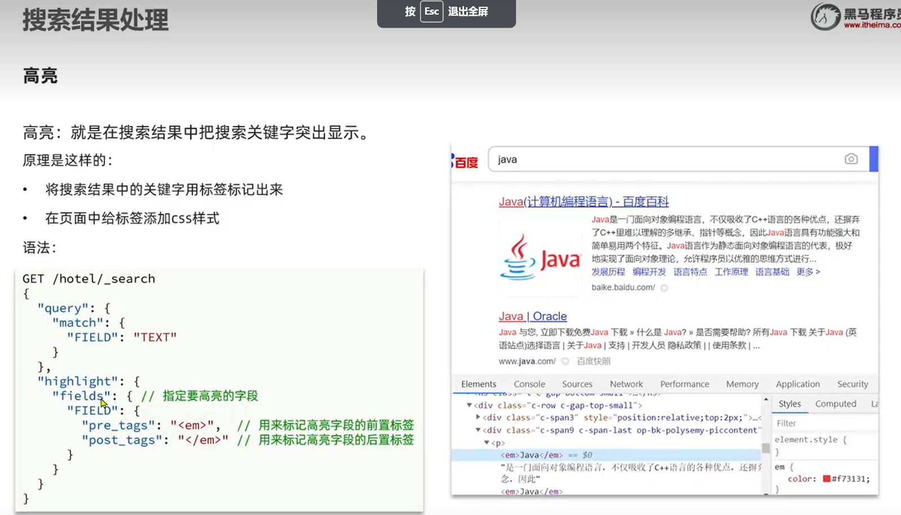
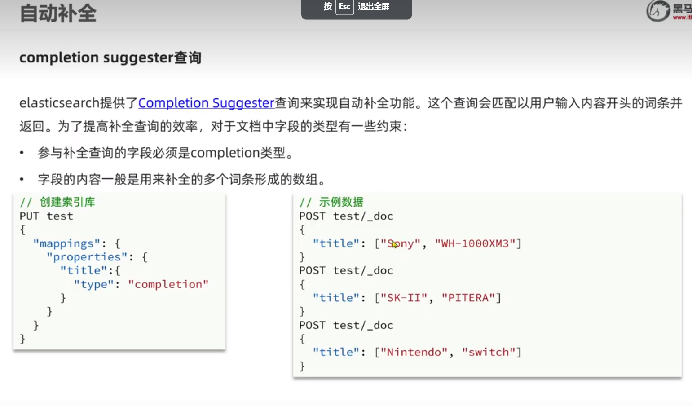
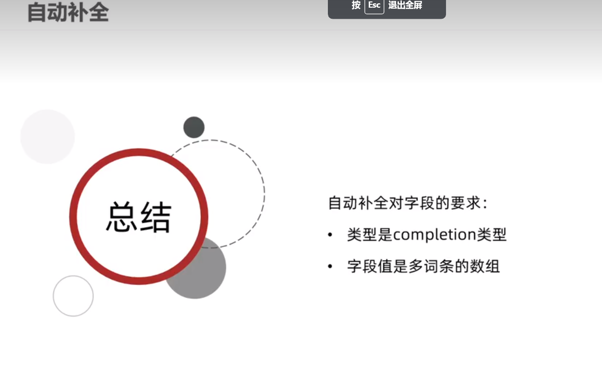
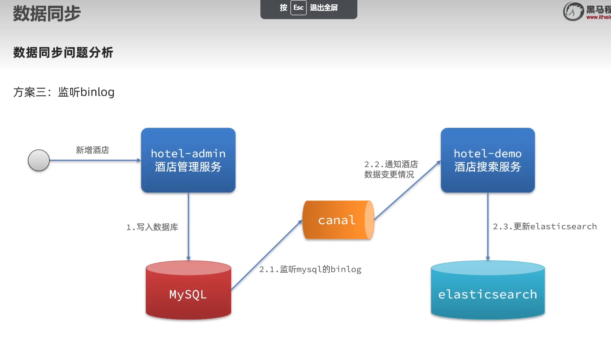

# 黑马Hotel使用ES搜索案例

技术要求：

| 技术工具 | 版本   | 端口号     |
| -------- | ------ | ---------- |
| mysql    | 8.0.29 | 3306       |
| rabbitmq | 3.9.11 | 5672/15672 |

ES工具

| 技术工具                | 版本   | 端口号    |
| ----------------------- | ------ | --------- |
| elasticsearch           | 7.17.6 | 9200/9300 |
| kibana                  | 7.17.6 | 5601      |
| mobz/elasticsearch-head | 5      | 9100      |

注意：es官方将它的高级客户端RestHighLevelClient标记为弃用状态。同时推出了全新的java API客户端Elasticsearch Java API Client，该客户端也将在Elasticsearch8.0及以后版本中成为官方推荐使用的客户端
| 服务         | 说明         |
| ------------ | ------------ |
| hotel-admin  | 酒店管理服务 |
| hotel-search | 酒店搜索服务 |

#### 环境搭建步骤：

##### rabbitmq搭建

1. 将项目下rabbitmq文件夹上传到服务器

2. 启动容器

   ```sh
   docker run -d -p 5672:5672 -p 15672:15672 -e RABBITMQ_DEFAULT_USER=admin -e RABBITMQ_DEFAULT_PASS=admin -v /data/rabbitmq/data:/var/lib/rabbitmq -v /data/rabbitmq/conf:/etc/rabbitmq -v /data/rabbitmq/log:/var/log/rabbitmq --name rabbitmq rabbitmq:latest
   ```

3. 进入容器，启动管理页面

   ```sh
   # 进入容器
   docker exec -it rabbitmq /bin/bash
   # 启动延时插件
   rabbitmq-plugins enable rabbitmq_management
   ```

4. 上传延时插件，并且启动延时插件

   ```sh
   # 将刚才上传的rabbitmq/plugins下的延时插件上传到容器内
   docker cp 延迟插件路径/rabbitmq_delayed_message_exchange-3.9.0.ez rabbitmq:/plugins/
   # 进入容器plugins目录，查看插件是否上传成功
   ls | grep delay
   # 启动延时插件
   rabbitmq-plugins enable rabbitmq_delayed_message_exchange
   ```

5. 重启容器

   ```sh
   docker restart rabbitmq
   ```

   ##### ES环境搭建

   1. 将elasticsearch文件夹上传到服务器，进入elasticsearch目录，执行创建服务命令

      ```sh
      cd elasticsearch
      # 启动容器组
      docker-compose up -d
      # 删除容器组
      docker-compose down
      ```

   2. elasticsearch-head连接不到es问题解决

      ```sh
      # 将容器内/usr/share/elasticsearch/config/elasticsearch.yml文件拷贝到服务器本地，然后本地修改elasticsearch.yml内容
      # 文件内新增两行配置
      http.cors.enabled: true
      http.cors.allow-origin: "*"
      # 保存文件，将文件重新传回容器，重启容器即可
      docker cp xxx/elasticsearch.yml 容器id:/usr/share/elasticsearch/config/
      ```

   3. elasticsearch-head查询出错问题解决

      报错：{"error":"Content-Type header[application/x-www-form-urlencoded] is not supported","status":406}

      修改**elasticsearch-head容器**配置/usr/src/app/_site/vendor.js

      将elasticsearch-head容器内/usr/src/app/_site/vendor.js文件复制到服务器，修改如下配置

      ```sh
      # 第6886行 
      /contentType: "application/x-www-form-urlencoded
      # 改为
      contentType: "application/json;charset=UTF-8"
      # 第7574行
      var inspectData = s.contentType === "application/x-www-form-urlencoded" &&
      # 改为
      var inspectData = s.contentType === "application/json;charset=UTF-8" &&
      ```

      修改完成后将文件上传回容器

      ```sh
      docker cp xxx/vendor.js 容器id:/usr/src/app/_site/
      ```

   4. 重启容器组便于修改生效

      ```sh
      # 停止容器组（在上传的elasticsearch目录下执行）
      docker-compose stop
      # 启动容器组
      docker-compose start
      ```

###### 案例:利用JavaRestClient实现创建、删除索引库、判断索引库是否存在

根据资料提供的酒店数据创建索引库，索引库名为hotel,mapping属性根据数据库结构定义。

基本步骤如下:

1. 导入资料Demo(导入tb_hotel.sql到数据库->导入hotel-search工程)

2. 分析数据结构，定义mapping属性(构建DSL不执行)

   ```
   # 构建酒店mapping
   PUT /hotel
   {
     "mappings": {
       "properties": {
         "id":{
           "type": "keyword"
         },
         "name":{
           "type": "text",
           "analyzer": "ik_max_word",
           "copy_to": "all"
         },
         "address":{
           "type": "keyword",
           "index": false
         },
         "price":{
           "type": "integer"
         },
         "score":{
           "type":"integer"
         },
         "brand":{
           "type": "keyword",
           "copy_to": "all"
         },
         "city":{
           "type": "keyword"
         },
         "starName":{
           "type": "keyword"
         },
         "business":{
           "type": "keyword",
           "copy_to": "all"
         },
         "location":{
           "type": "geo_point"
         },
         "pic":{
           "type": "keyword",
           "index": false
         },
         "all":{
           "type": "text",
           "analyzer": "ik_max_word"
         }
       }
     }
   }
   ```

   es支持两种地理坐标类型：

   geo_point:由纬度(latitude)和经度(longitude)确定一个点，例如："32.8752345,120.2981576"

   geo_shape:有多个geo_point组成的复杂几何图形。例如一条直线，“LINESTRING(-77.03653 38.897676,-77.009051 38.889939)”

   ES支持的地图检索方式有以下几种；

   geo_distance：直线距离检索，如给定点A，要求返回地图上距离点A三千米的店铺

   geo_bounding_box：以两个点确定一个矩形，获取在矩形内的全部数据

   geo_polygon：以多个点，确定多边形，获取多边形内的全部数据

3. 初始化JavaRestClient

4. 利用JavaRestClient创建索引库

   

5. 利用JavaRestClient删除索引库

6. 利用JavaRestClient判断索引库是否存在

   索引库操作的基本步骤:

   - 初始化RestHighLevelClient
   - 创建XxxIndexRequest.Xxx是Create,Get,Delete
   - 准备DSL(Create时需要)
   - 发送请求。调用RestHighLevelClient#indices().xxx（）方法，xxx是create,exist,delete

###### 案例:利用JavaRestClient实现文档的CRUD

去数据库查询酒店数据，导入到hotel索引库，实现酒店数据的CRUD

基本步骤如下:

1. 初始化JavaRestClient
2. 利用JavaRestClient新增酒店数据到索引库
3. 利用JavaRestClient根据id查询酒店数据
4. 利用JavaRestClient删除酒店数据
5. 利用JavaRestClient修改酒店数据

###### 案例:利用JavaRestClient批量导入数据到ES

需求:批量查询酒店数据，然后导入索引库中

思路:

1. 利用mybatis-plus查询酒店数据

2. 将查询到的酒店数据（Hotel）转换为文档类型数据（HotelDoc）

3. 利用JavaRestClient的Bulk批处理，实现批量新增文档。示例代码如下：

   

DSL查询方式:

elasticsearch中的相关性打分算法是什么？

TF-IDF:在elasticsearch5.0之前，会随着词频增加而越来越达

BM25:在elasticsearch5.0之后，会随着词频增加而增大，但增长曲线会趋于水平


DSL算分例子


复合查询Boolean Query

布尔查询是一个或多个查询子句的组合，子查询的组合方式有：

- must:必须匹配每个子查询，类似”与“
- should:选择性匹配子查询，类似”或“
- must_not:必须不匹配，不参与算分，类似”非“
- filter：必须匹配，不参与算分

分页：


高亮处理：



es搜索字段必须与高亮字段一致，如果不一致高亮需要配置

```api
# 高亮查询,默认情况下，es搜索字段必须与高亮字段一致
GET /hotel/_search
{
  "query": {
    "match": {
      "all":"如家"
    }
  },
  "highlight": {
    "fields": {
      "name": {
        "require_field_match": "false" //打破搜索字段与高亮字段一致设置
      }
    }
  }
}
```


数据聚合：

什么是聚合？

聚合是对文档数据的统计、分析、计算


参与聚合的字段类型必须是：

keyword、数值、日期、布尔


自动补全，依赖拼音分词器


自定义索引库分词方案


拼音分词器 适合创建时使用，不适合搜索时使用


自动补全：






###### 案例:实现hotel索引库的自动补全，拼音搜索功能

实现思路如下:

1. 修改hotel索引库结构，设置自定义拼音分词器
2. 修改索引库的name,all字段，使用自定义分词器
3. 索引库添加一个新字段suggestion,类型为completion类型，使用自定义分词器
4. 给HotelDoc类添加suggestion字段，内容包含brand、business
5. 重新导入数据到hotel库


自动补全结果解析


###### 数据同步方案





###### 案例:利用MQ实现mysql与elasticsearch数据同步（方案二）

利用资料提供的hotel-admin项目作为酒店管理的微服务。当酒店数据发生增、删、改时，要求对elasticsearch中数据也要完成相同操作。

步骤：

- 导入资料提供的hotel-admin项目，启动并测试酒店数据的CRUD
- 声明exchange、queue、Routingkey
- 在hotel-admin中的增、删、改业务中完成消息发送
- 在hotel-search中完成消息监听，并更新elasticsearch中的数据
- 启动并测试数据同步功能

